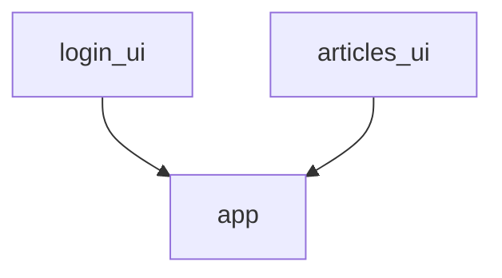
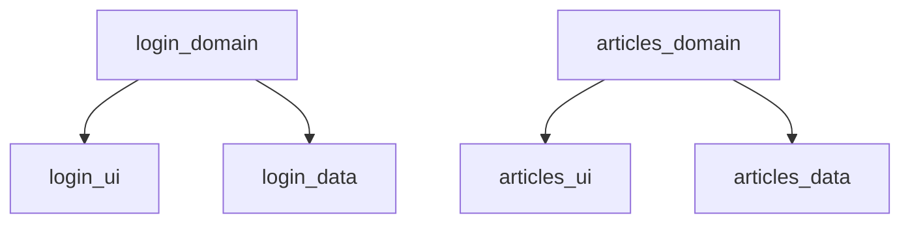
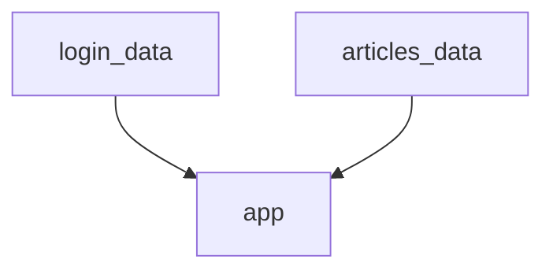
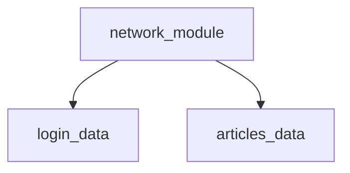

# FeatureMultiModuleArch

Understanding the multi module architecture as a mix of Feature based and layer based for Android application.

Structure:
1. UI modules - Separate UI modules by features, contains the views(Activity, Fragment, ViewModel, XML, Jetpack Compose) based on features
2. Domain modules - contains usecases related to features
3. Data modules - contains repositories implementation, data sources by features
4. Common modules - contains reusable code, added to repective modules. Like reusable views can be added to ui modules whereever required.

As the appliction's app module is aware of only what is being displayed to the end user see and how they interact with the UI, and unaware of the backend implementation and business logic for the functionalities. All the UI modules will be added as dependencies to app module.

Domain contains the **abstract API(interfaces)** which are **independent** to any modules and contains the business logic and pure Kotlin/Java code. These interfaces are used by the UI module as a structure to call for bahavior without knowing the actual implementation. And the Data module uses for providing the actual implementation of the abstract behavior.

Dependencies to the Abstract APIs of the domain module are resolved using **Dependency Injection (DI)**. They are supplied by 3rd party modules, here it is an app module. The implementations or concrete classes dependencies are provided by Data modules and are added as dependencies to app module. The DI creates and provides the implementation to the abstration to use cases in domain.

There might be other core or common modules depending on the situations, and based on requirement they are added as dependencies to other modules. Here network module is added as dependencies to Data modules to provide network related objects like Retrofit. There can be resuable UIs to be used among different UI modules so they will be added as dependencies to UI modules.
